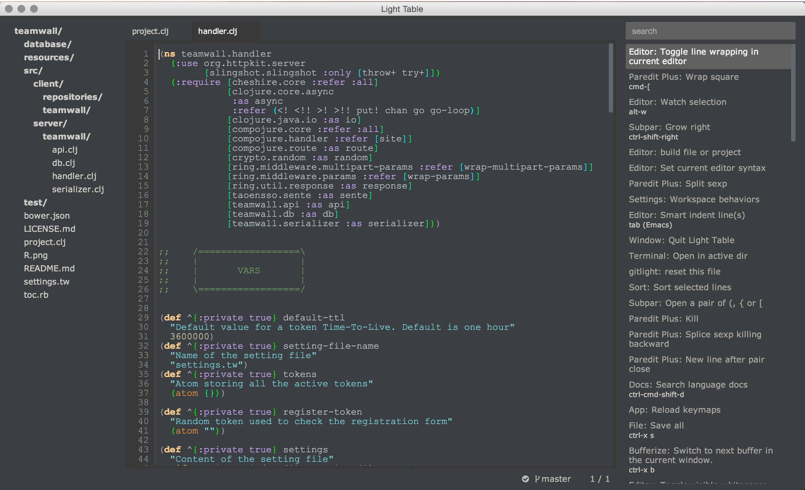

# Obsidian LightTable theme

A dark theme for LightTable. Based on Notepad++ Obsidian theme

## Scrennshot

## License

 

The original theme is part of Notepad++ while the LightTable version was written by [Pablo A. Mayobre](https://github.com/Positive07)

The Nifleheim theme, this theme is based on, was written by [Benjamin Van Ryseghem](http://benjamin.vanryseghem.com).

Obsidian by <a xmlns:cc="http://creativecommons.org/ns#" href="https://www.github.com/Positive07" property="cc:attributionName" rel="cc:attributionURL">Pablo A. Mayobre</a> is licensed under a <a rel="license" href="http://creativecommons.org/licenses/by-sa/4.0/">Creative Commons Attribution-ShareAlike 4.0 International License</a>. Based on a work at <a xmlns:dct="http://purl.org/dc/terms/" href="https://github.com/niflheim-theme/niflheim-theme-lighttable" rel="dct:source">https://github.com/niflheim-theme/niflheim-theme-lighttable</a>.
